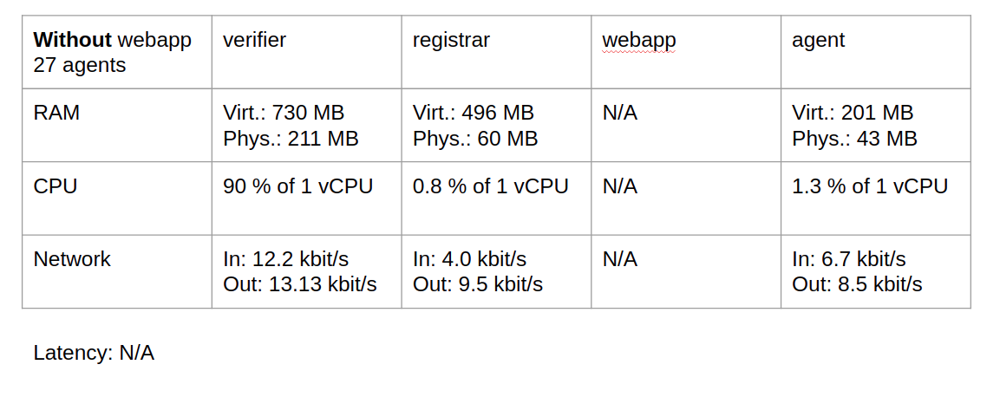
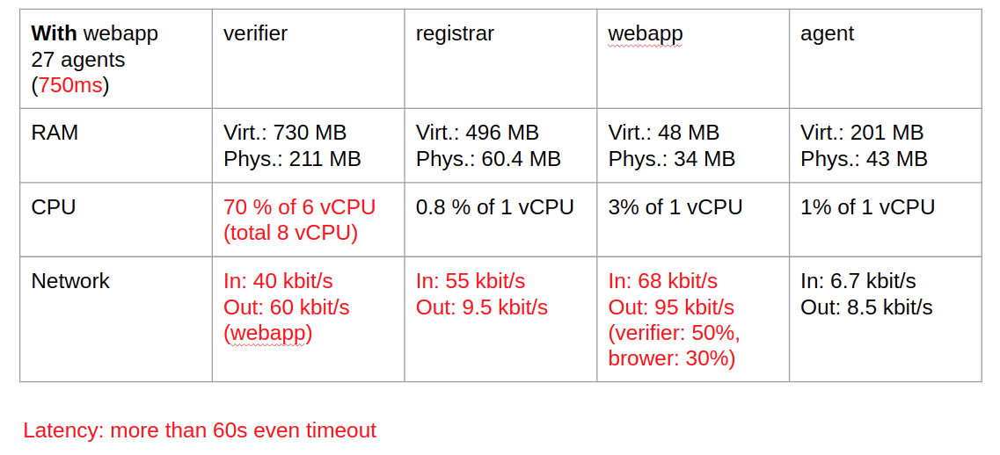
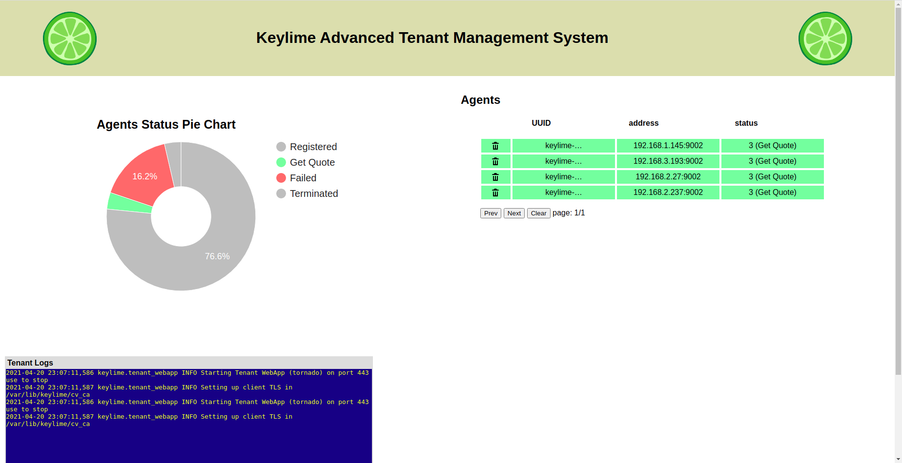
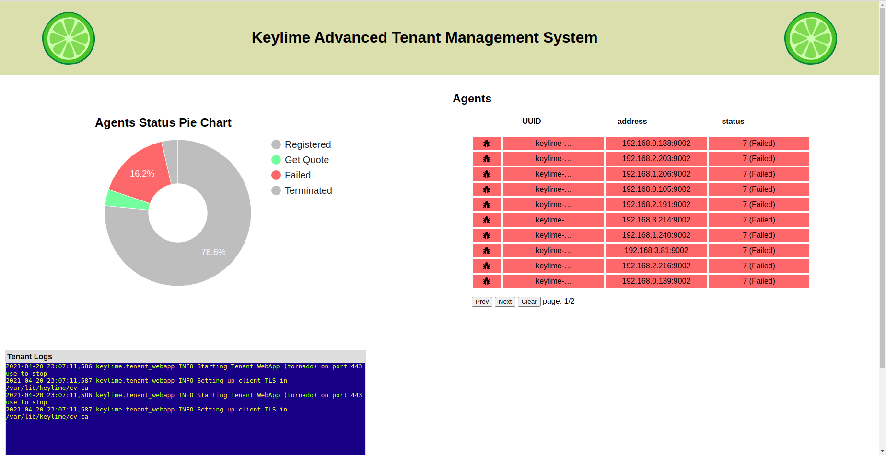

# Performance-analysis-of-Keylime

## 1. Vision and Goals Of The Project:

This project is based on an open-source remote attestation system called Keylime. To be specific, we focus on at-scale data profiling, data collection and visualization. For the short term, by the end of this semester, our project should satisfy the following requirements:

- Displaying information in a concise way while dealing with a large number of machines.
- Collecting information for display without affecting attestation itself.
- Tracking over time: attestation is a time series event.
- Minimizing changes in Keylime itself.

As for stretch goals, we expect our project can do the following as well:

- If time permits, merge our codebase to Keylime.
- Give an acceptable engineering solution for visualization at large scale.

## 2. Users/Personas Of The Project:

The new webapp front-end UI targets cloud administrators and researchers who want to:

- Get a high level view of all agent nodes' status rendered in a pie chart(e.g., the number/percentage/proportion of failed nodes amongst all nodes in the cloud).
- Obtain a single node's detailed status information.
- Tell keylime to provision a specific node.
- Get logging information from console running Keylime_webapp service.

## 3. Scope and Features Of The Project:

The performance analysis part:

- Analyzing the performance of existing Keylime web app
- Finding the bottleneck of it
- Improving the performance and support larger number of nodes

The scope of the visualization methodology includes the following parts:

- Being able to visualize the collected data in real-time.
- A prototype of the large scale visualization, which lets the user tell what’s going on in the remote cluster without too much effort.
- A web front-end project that implements all of the functionalities in the prototype.

As for the data-pipeline, the scope consists of:

- Collecting meaningful data (e.g. via API calls)
- Processing data efficiently 

## 4. Solution Concept

### Remote Attestation Workflow in Keylime

The diagram above shows Keylime's remote attestation workflow. It starts with the whitelist.txt (what we expect the remote node to be). And then, the verifier generates a nonce to deal with the replay attacks. After that, TPM is going to execute the "Quote" operation with the given nonce and it's own private AIK. After receiving the signature, the verifier will get this agent's public key from the registrar. Finally, the verifier will decrypt the signed message using the public key and compare the current state with the whitelist.

### Existing Visualization Webapp

This diagram describles the visualization architecture from a high-level perspective. To get the latest states of all agents, keylime webapp firstly finds a list of registered agents from registrar DB. And then, it gets the details of every agent asynchronously from verifier DB. Although seems like it's possible to retrieve all of records from verifier directly, we must retrieve a list of registered agents first since some registered agents might not exist in verifier DB yet (some registered agents are in registrar DB but not in verifier DB). Further discussion can be found in this [issue](https://github.com/keylime/keylime/issues/628).

### Visualization webapp Performance Analysis

The following command-line tools are used to monitor the web app:
- htop: CPU & RAM usage
- nload: total bandwidth
- nethogs: bandwidth per process
- lftop: bandwidth per network interface
- Browser's dev tool: overall latency

When running keylime without webapp GUI, all performance metrics are fine. However after the GUI starts, verifier constantly use 70% CPU time of 6 vCPUs (out of 8 vCPUs). The maximum latency is greater than 60s. It's clear that running webapp GUI is an **I/O bounding** task to keylime services. Specifically, verifier becomes the bottleneck because it has to process a large amount of requests from webapp and retrieve data from DB frequently. In conclusion, keylime backend services are overloaded by the visualization webapp.

Thus, we tested the webapp with 27, 61, 108 agents and multiple update frequencies. When the throughput (1 agent = 1 request, throughput = # of agents / update interval ) is around **5 requests/sec**, CPU and RAM usage is quite moderate. When the throughput is around **21 requests/sec**, the averge latency can be larger than 60 seconds. Meanwhile, the verifier uses over 70% CPU time of 7 out 8 vCPUs. The **maximum throughput** that verifier can handle with 8 vCPUs and 16GB RAM is **12~13 requests/sec**. Sending requests to verifier at this rate won't make a significant negative impact on the performance.

### Duplicated backend API calls

Technically speaking, each agent_id should be checked one time per interval, but keylime webapp is sending a duplicated API call to verifier for each agent. As a result, if there are n registered agents in the system, 2 * n (to verifier) + 1 (to registrar) API calls will be made instead of n + 1. Further description on this issue can be found [here](https://github.com/keylime/keylime/issues/634). Our [PR](https://github.com/keylime/keylime/pull/635) is under review by the team.

### New Visualization GUI

The current webapp GUI is not very attractive to users because it simply shows all agents in a list. When there are more than 20 agents, it becomes very hard to go through all of them. Moreover, it's lack of a high-level summary of the system. Thus, we propose a new GUI design, which consists of a pie-chart to give users an overview of the system. If a section (state category) is selected, agents of such state will be list on the right in a paginated manner.

Besides UI changes, we also break requests into smaller batches so that each interval only one batch will be sent to the verifier. In this way, we can make sure that the traffic between webapp and verifier won't exceed the max throughput. Ultimately, webapp won't lower the performance of other keylime services.

Finally, to make keylime webapp easier to maintain and more attractive to other developers, some outdated JS code is replaced by modern API or syntax. Further description on the new GUI can be found [here](https://github.com/keylime/keylime/issues/636). Our [PR](https://github.com/keylime/keylime/pull/637) is under review by the team. Based on the comments, we will try to get it merged by the middle of this week (April 28th 2021).

### Ansible Auto-Deployment

Our project uses Ansible to automate deployment on MOC. There are 4 playbooks to seperately manage agents, verifier, registrar and webapp. Instructions on how we use Ansible can be found [here](https://github.com/FengqiQiao/keylime_ansible). 

## 5. Acceptance criteria

Minimum acceptance criteria:

- Backend: Tracking and collecting Information(time series data) from a cluster of nodes. Formatting the data for displaying purpose.
- Frontend: Displaying information(run-time system integrity) in a concise way.

Stretch goals:

- Be able to scale up for monitoring up-to 5k nodes.
- If time permits, upstream to Open Source Keylime project.

## 6. Release Planning:

- Sprint #1(By Feb. 28, 2021):  
   Install keylime packages & configure local environment.
   Run keylime services.

- Sprint #2(By Mar. 12, 2021): 
   Set up MOC cluster for keylime services.
   Do integration test manually.

- Sprint #3(By Mar. 26, 2021):  
   Using **Ansible** automate dependency installation & uninstallation, configuration.
   Test keylime with 108 agents.
   Analyze the performance bottleneck in keylime webapp (visualization) workflow.

- Release #1:  
   In the first [Pull Request](https://github.com/keylime/keylime/pull/601), some config variable are added to control the throughput between webapp and verifier so that the webapp won't overload other services.

- Sprint #4(By Apr. 9, 2021):  
   Half the number of API calls for visualization.
   Implement a prototype with **2 visualization graphs**: a classic pie-chart (Google Chart) and an interactive sunburst chart (D3.js). Considering the usability at a large scale, the **pie-chart** is preferred over sunburst chart by the keylime team.

- Release #2:  
   In the second [Pull Request](https://github.com/keylime/keylime/pull/635), duplicated API calls are removed.  
   In the thrid [Pull Request](https://github.com/keylime/keylime/pull/637), the new GUI is under review.
