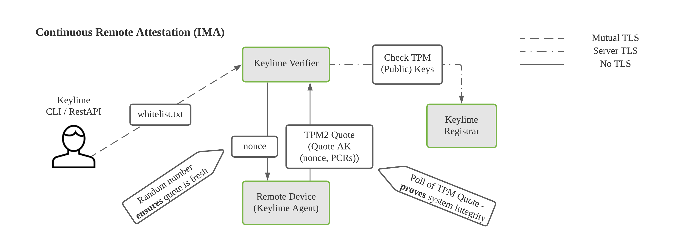

# Performance-analysis-of-Keylime

## 1. Vision and Goals Of The Project:

This project is based on an open-source remote attestation system called Keylime. To be specific, we focus on at-scale data profiling, data collection and visualization. For the short term, by the end of this semester, our project should satisfy the following requirements:

- Displaying information in a concise way while dealing with a large number of machines.
- Collecting information for display without affecting attestation itself.
- Tracking over time: attestation is a time series event.
- Minimizing changes in Keylime itself.

As for stretch goals, we expect our project can do the following as well:

- If time permits, merge our codebase to Keylime.
- Give an acceptable engineering solution for visualization at large scale.

## 2. Users/Personas Of The Project:

The new webapp front-end UI targets cloud administrators and researchers who want to:

- Get a high level view of all agent nodes' status rendered in a pie chart(e.g., the number/percentage/proportion of failed nodes amongst all nodes in the cloud).
- Obtain a single node's detailed status information.
- Tell keylime to provision a specific node.
- Get logging information from console running Keylime_webapp service.

## 3. Scope and Features Of The Project:

The scope of the visualization methodology includes the following parts:

- Being able to visualize the time series data in real-time.
- A prototype of the large scale visualization, which lets the user tell what’s going on in the remote cluster without too much effort.
- A web front-end project that implements all of the functionalities in the prototype.

As for the data-pipeline, the scope consists of:

- Collecting meaningful data (e.g. via DB queries)
- Processing data efficiently
- A service that periodically send the collected and processed data to the front-end

## 4. Solution Concept

### Remote Attestation Workflow in Keylime

The diagram above shows Keylime's remote attestation workflow. It starts with the whitelist.txt (what we expect the remote node to be). And then, the verifier generates a nonce to deal with the replay attacks. After that, TPM is going to execute the "Quote" operation with the given nonce and it's own private AIK. After receiving the signature, the verifier will get this agent's public key from the registrar. Finally, the verifier will decrypt the signed message using the public key and compare the current state with the whitelist.

### Existing Visualization Webapp

This diagram describles the existing visualization architecture from a high-level perspective. To get the state for a certain agent, the web app runs a query in verifier DB and return the details of such agent back to the front-end. To get all agents' states, it firstly finds a list of agents from the registrar DB. And then, it gets the details of every agent one by one from verifier DB. The data collection might not be very efficient since it requires multiple reads from the DB. As for a cluster with 200 nodes, it's going to run 200 queries in verifier DB. This might be part of the reason why it doesn't scale well.

## 5. Acceptance criteria

Minimum acceptance criteria:

- Backend: Tracking and collecting Information(time series data) from a cluster of nodes. Formatting the data for displaying purpose.
- Frontend: Displaying information(run-time system integrity) in a concise way.

Stretch goals:

- Be able to scale up for monitoring up-to 5k nodes.
- If time permits, upstream to Open Source Keylime project.

## 6. Release Planning:

Detailed group plan and coverage can be found on the Trello board: to be created

- Release #1(due by Week 7):  
   Build a visualization front-end prototype for data profiling  
   Back-end implementation supporting a relative small number of nodes.  
   ...

- Release #2(due by Week 9):  
  Front-end implementation supporting a relative small number of nodes.  
   ...

- Release #3(due by Week 13):  
  Scale-up to support a relatively large number of nodes.  
   ...
